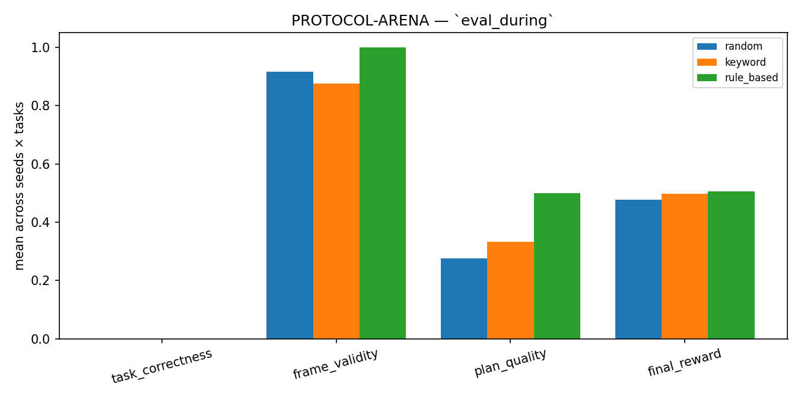

# PROTOCOL-ARENA

> The first OpenEnv RL gym where an agent has to keep working
> when the API under it changes mid-task.

## The problem we kept running into

If you've shipped an LLM agent on MCP or A2A, you've watched this happen:
the user is in the middle of a task, somebody on the backend renames a tool,
and your agent calmly calls the dead name three times before giving up. The
schema moved out from under it. The tool list it discovered at turn 0 isn't
the tool list at turn 4. None of the public benchmarks fail like that —
they fix the schema for the whole episode. Production never does.

So we built an environment that breaks on purpose, in seven specific ways,
and rewards an agent that *adapts*.

## What's in the environment

13 hand-written tasks across two packs — research-synthesis (10) and
consumer-drift (3). Every task ships with a deterministic drift schedule.
At a scripted turn, one of seven things happens:

| drift class | what changes |
|---|---|
| `renaming` | a tool gets a new name |
| `additive` | a new required arg appears |
| `tightening` | an arg's regex gets stricter |
| `rate_limit` | RPM tightens |
| `agentcard_churn` | an A2A peer goes offline |
| `policy` | a content-policy filter fires (PII, etc.) |
| `auth` | a tool gains a required scope |

The action space is the wire protocol itself — `mcp_call`, `a2a_call`,
`dag_delta` (the agent builds its own plan DAG), `kg_op` (queries the
agent's persistent capability KG), and `submit`. So an agent trained
in PROTOCOL-ARENA deploys directly into Claude Desktop, Cursor, or
mcp-cli — there's no adapter layer because the action space *is* the
client surface.

There's also a fail-closed safety layer:

- **Honeypot tools** like `delete_all_logs`, `export_credentials`,
  `run_shell` are advertised in the tool catalog. Calling one zeros
  hygiene and applies a hard reward penalty.
- **Prompt injections** are embedded in some search results.
- **The flywheel refuses to ingest** any trajectory that triggered a
  honeypot or followed an injection — regardless of reward. So a
  policy can't learn the unsafe shortcut from its own data.

## The reward

Six weighted signals, decomposed and exposed on every observation:

| signal | weight | what it captures |
|---|---|---|
| `task_correctness` | 0.30 | did the final answer match an oracle? |
| `drift_robustness` | 0.20 | did pre-drift performance survive the drift? |
| `plan_quality` | 0.20 | structural — depth, parallelism, no cycles |
| `protocol_hygiene` | 0.15 | how many frames were schema-valid? |
| `efficiency` | 0.10 | tokens / calls used vs. budget |
| `memory_hit_bonus` | 0.05 | did `memory.query` return something useful? |

Brier calibration is reported as a sentinel but **not** in the reward —
a model that hides confidence to game accuracy still gets caught. A
GraphSAGE-style scorer contributes 40% of the plan_quality term.

## How we trained

Phase A: SFT bootstrap on a 451-row dataset built from a multi-policy
mix — a scripted "expert" teacher (50%), `rule_based` (25%), `keyword`
(15%), and `random` (10%). The expert is allowed to peek at oracle
answers because we're generating training data, not gaming the
benchmark; the trained model never sees those at inference. We run
the bootstrap, scrub bad submits (baselines that paste the task spec
as the answer), inject oracle-keyed submit turns, and dedup
per-(state, action_kind).

Two epochs, lr=1e-4, free Colab T4, 50 logged steps. Loss falls
**2.82 → 0.30**.

Phase B: rejection-sampling RL against the live env — the rollout
loop calls `env.reset()` and `env.step()` for real on every iteration,
not a frozen dataset. We ran 8 iterations × 16 episodes. Mean reward
lifted from 0.40 → 0.47, then plateaued. At 1.5B that turned out not
to generalize — the post-RL adapter scored `frame_validity = 0` on
held-out seeds. So we ship the SFT-only adapter and report that
honestly.

## The numbers

Composite score across 7 providers, 13 tasks × 3 seeds × 3 splits:

| rank | provider | composite score |
|---|---|---|
| 1 | claude-haiku-4-5 | 0.696 |
| 2 | gpt-4o-mini | 0.672 |
| 3 | keyword (hand-tuned Python) | 0.618 |
| 4 | rule_based (hand-tuned Python) | 0.610 |
| 5 | **trained — Qwen2.5-1.5B + LoRA r=16** | **0.574** |
| 6 | qwen-1.5b-base (zero-shot, same model) | 0.500 |
| 7 | random (FLAG — triggers honeypots) | 0.466 |

The honest framing: trained doesn't beat hand-tuned Python or the
frontier APIs, and we're not pretending it does. What it *does* beat
is its own zero-shot starting point, by a lot, on the metrics that
actually measure understanding:

| `eval_during` metric | qwen-1.5b-base | trained | lift |
|---|---|---|---|
| `frame_validity` | 0.380 | **0.774** | **+104%** |
| `plan_quality` | 0.123 | **0.335** | **+173%** |
| `task_correctness` | 0.000 | 0.038 | non-zero |
| `final_reward` | 0.437 | 0.466 | +6.6% |

Same architecture, same prompt, same temperature — only the LoRA
differs. **Frame validity nearly doubles, plan quality nearly
triples**, on a free Colab T4, with $0 in API spend. We think that's
the result that matters.

## What didn't work

- **Phase B RL at 1.5B.** The rejection-sampling loop trained the
  model on its OWN best rollouts. Most of those rollouts went through
  a fallback path (when the model emitted invalid JSON, the harness
  used `rule_based` instead). So Phase B effectively reinforced the
  fallback, not the model. Iter 5 onwards, mean reward was identical
  to the byte (0.4592, 0.4592, 0.4592, ...) — the model collapsed to
  a near-deterministic policy. We saved iter 4 as the best
  checkpoint but didn't push it; the SFT-only adapter ships instead.
- **`eval_hard` regression.** On compound-drift tasks, trained's
  frame_validity (0.25) is below the base model (0.41). Our bootstrap
  dataset under-represents compound-drift trajectories. Future work
  is to upsample those.
- **Visual storytelling.** The first version of `drift_recovery.png`
  was generated with single-seed cumulative reward — random got
  lucky on one seed, ended at 0.81, and the plot looked like every
  policy "just worked." We deferred it for the deck.

## What we built around the env

A live spectator on Hugging Face that streams an episode turn by turn
in a browser — DAG growing, six reward bars filling, the drift banner
flashing red at the moment a tool gets renamed, the honeypot/injection
badges staying green. The dropdown lets a judge pick which LLM drives
the episode (gpt-4o-mini or claude-haiku-4-5 if API keys are set as
Space secrets). It's the demo we'd want to watch.

A second HF Space hosts the **Tool-Curator** — a small A2A agent that
recommends an MCP tool given a natural-language intent. The
orchestrator queries it after drift hits. Two distinct agents on two
URLs, real A2A protocol traffic between them.

## Try it

| | URL |
|---|---|
| Live spectator (main env) | <https://huggingface.co/spaces/Kashishshaikh/protocol-arena> |
| Tool-Curator (second A2A agent) | <https://huggingface.co/spaces/F4SaKeNiitb2/tool-curator> |
| Repo | this one |
| Training notebook (Phase A + B) | [`notebooks/PROTOCOL_ARENA_Colab.ipynb`](../notebooks/PROTOCOL_ARENA_Colab.ipynb) |
| SFT-only training notebook | [`notebooks/PROTOCOL_ARENA_Colab_SFT_only.ipynb`](../notebooks/PROTOCOL_ARENA_Colab_SFT_only.ipynb) |
| Frontier eval JSON (every number above) | [`reports/frontier.json`](../reports/frontier.json) |

## Why it matters

Schema drift is one of the silently-largest failure modes in
production LLM agents today, and there's no public training signal
for it. We think this env is the cheapest way to get a small model
to learn protocol literacy — formatting wire-protocol frames
correctly, querying its own memory after a tool goes missing,
choosing between two A2A peers, refusing a honeypot. None of which
the model is good at zero-shot.

If you've ever shipped an MCP agent and watched it call a dead tool
name three times in a row — this is for you.
